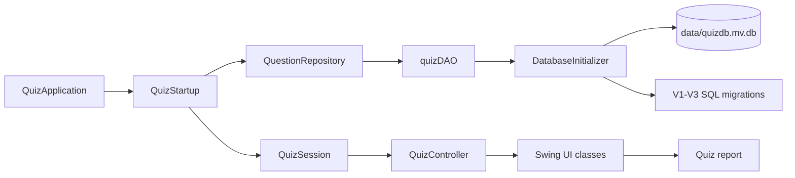

# FBLA Quiz Application

[](https://github.com/Saideep2019/FBLA2021/actions/workflows/maven-ci.yml?query=branch%3Amodernization)

## Project overview

The FBLA Quiz Application is a Java desktop quiz project modernized from its original 2021 codebase. It presents a five-question quiz drawn from a local, versioned question bank, gives immediate answer feedback, tracks the score, and displays a final attempt report.

The modernization keeps the original Swing desktop experience and quiz content history while introducing Java 17, a reproducible Maven build, testable domain and UI boundaries, H2 2.x database migrations, automated tests, and GitHub Actions continuous integration.

## Welcome screen


The opening screen introduces the five-question quiz with a coordinated loading view,
an optional name field, and a keyboard-accessible **Start quiz** button. Enter a name
for the results report, or leave it blank to begin without one. Press Enter or select
**Start quiz** to continue.

## Questions and results

The question screen shares the welcome screen's navy and teal palette, with a
progress indicator, a live correct-answer count, and clearly selected answer controls.
The final report presents accuracy and totals above a scrollable answer review.


These previews are rendered from the actual Swing components using sample inputs.

## Main features

- Selects five distinct questions at random for each quiz session.
- Supports four question presentations: four-button multiple choice, drop-down, true/false, and fill-in-the-blank.
- Validates that an answer has been supplied before advancing.
- Scores answers case-insensitively and provides immediate correct/incorrect feedback.
- Produces a read-only final report with each question, the expected answer, the submitted answer, and summary totals.
- Initializes and migrates a local H2 runtime database from SQL resources packaged inside the application.
- Preserves the original database artifacts separately from the generated runtime database.

## Technology stack

| Area | Technology |
|---|---|
| Language | Java 17 |
| Desktop UI | Java Swing |
| Database | H2 2.4.240, file-backed |
| Build | Maven 3.9.11 through Maven Wrapper 3.3.4 |
| Testing | JUnit Jupiter 5.11.4 and Maven Surefire |
| Packaging | Maven Shade Plugin runnable JAR |
| Continuous integration | GitHub Actions on Ubuntu with Eclipse Temurin 17 |

## Application architecture



The application separates content access, quiz rules, and Swing presentation so each area can be tested independently.

### `QuestionRepository`

`QuestionRepository` is the model-layer boundary for loading questions. Its single `findAllQuestions()` operation lets `QuizSession` depend on an abstraction rather than JDBC. The existing `quizDAO` class implements the interface: it initializes the runtime database, loads ordered questions and answer choices, validates required data, maps legacy display-type numbers to the `Question.DisplayType` enum, and owns the H2 connection lifecycle.

### `QuizSession`

`QuizSession` owns the rules for one attempt. It removes duplicate question IDs, selects five distinct questions using an injected `Random`, exposes the current question, rejects blank submissions, records each `QuizResult`, updates the score, and produces an immutable `QuizReport`. It contains no Swing or JDBC code, which keeps the quiz behavior deterministic under test.

### Swing UI classes

- `QuizApplication` is the entry point and lifecycle coordinator. It starts on Swing's Event Dispatch Thread, owns repository cleanup, and connects startup, session, controller, and windows.
- `QuizStartup` uses `SwingWorker` to load content and create the session without blocking the Event Dispatch Thread.
- `QuizController` translates submit actions into `QuizSession` operations and updates the `QuizView`.
- `QuizApplicationUi`, `QuizView`, and `QuizWindow` define small UI boundaries used by the coordinator and controller.
- `SwingQuizApplicationUi` supplies the loading window, name prompt, failure dialog, and concrete quiz window.
- `QuizFrame` hosts `QuizQuestionScreen`, which presents the question, progress, score, and submit controls. `QuestionCardPanel` switches among the four specialized question panels with `CardLayout`.
- `QuizReportFrame` and `QuizReportPanel` render read-only summary cards and a scrollable answer review. `QuizReportTableModel` retains the legacy tabular representation.

### `DatabaseInitializer`

`DatabaseInitializer` creates and upgrades the generated `data/quizdb.mv.db` database. It applies pending classpath migrations in version order inside transactions and records them in `SCHEMA_MIGRATIONS`. For a compatible pre-migration runtime database, it first verifies the legacy schema and deterministic content checksums, records V1 and V2 as its baseline, and then applies V3. An incompatible database fails closed.

The initializer explicitly refuses to target either preserved database path:

- `quizdb.mv.db`
- `database/backup/quizdb-original.mv.db`

Those files are historical source artifacts, not runtime databases. Normal application startup writes only beneath the ignored `data/` directory.

## Versioned database migrations

The custom migration runner packages three SQL resources in `src/main/resources/db/migration/`:

| Migration | Purpose |
|---|---|
| [`V1__quiz_schema.sql`](src/main/resources/db/migration/V1__quiz_schema.sql) | Creates the H2 2.x `QUESTIONS` and `ANSWERS` schema compatible with the preserved data model. |
| [`V2__quiz_content.sql`](src/main/resources/db/migration/V2__quiz_content.sql) | Imports the mechanically preserved legacy quiz rows. This historical import remains unchanged. |
| [`V3__quiz_content_corrections.sql`](src/main/resources/db/migration/V3__quiz_content_corrections.sql) | Applies the reviewed content corrections, completes true/false options, and normalizes answer IDs. |

See [`database/SCHEMA.md`](database/SCHEMA.md) for the preservation and schema notes and [`docs/content-audit.md`](docs/content-audit.md) for the evidence-backed content review.

## Build with Java 17 and the Maven Wrapper

### Prerequisites

- A Java 17 JDK available on `PATH`.
- Internet access the first time the Maven Wrapper downloads its pinned Maven distribution and project dependencies.

Confirm Java before building:

```text
java -version
```

Run all commands from the repository root. A separate Maven installation is not required.

### Windows PowerShell or Command Prompt

```powershell
.\mvnw.cmd clean verify
```

### macOS or Linux

```bash
chmod +x ./mvnw
./mvnw clean verify
```

A successful build creates the runnable shaded JAR at `target/quiz-app.jar`.

## Run the application

Build the application first, remain in the repository root, and use a graphical desktop environment.

### Windows

```powershell
java -jar .\target\quiz-app.jar
```

### macOS

```bash
java -jar target/quiz-app.jar
```

### Linux

```bash
java -jar target/quiz-app.jar
```

On first use, the application creates `data/quizdb.mv.db` and applies V1 through V3. The `data/` directory is excluded from version control.

## Testing

The full verification command compiles the application, runs all JUnit tests, and packages the runnable JAR:

```powershell
# Windows
.\mvnw.cmd clean verify
```

```bash
# macOS and Linux
chmod +x ./mvnw
./mvnw clean verify
```

The suite covers domain selection and scoring, reports, JDBC mapping, database initialization and migrations, content invariants, startup behavior, controller interactions, and Swing component state. Surefire writes detailed results to `target/surefire-reports/`.

## GitHub Actions CI

The [`Maven CI` workflow](.github/workflows/maven-ci.yml) runs for pushes and pull requests targeting `master` or `modernization`. It:

1. Rejects prohibited generated, IDE, database-trace, lock, and legacy binary artifacts if they become tracked.
2. Configures Eclipse Temurin Java 17 and the Maven dependency cache.
3. Runs `./mvnw --batch-mode --no-transfer-progress clean verify -Djava.awt.headless=true`.
4. Verifies that the runnable JAR contains the entry point, H2 driver, migrations, and image resources but no database or runtime-data files.
5. Rechecks both protected database SHA-256 hashes.
6. Uploads the runnable JAR after success and uploads Surefire reports when available; both artifacts have a seven-day retention period.

The badge at the top of this README reports the workflow status for the `modernization` branch.

## Repository structure

```text
.
├── .github/workflows/maven-ci.yml       # Continuous-integration workflow
├── .mvn/wrapper/                        # Pinned Maven Wrapper runtime
├── database/
│   ├── backup/quizdb-original.mv.db     # Preserved original database
│   ├── quiz-content.sql                 # Deterministic legacy SQL export
│   └── SCHEMA.md                        # Schema and preservation notes
├── docs/content-audit.md                # Quiz-content audit and sources
├── src/main/java/
│   ├── codingandProgramming/model/      # Questions, sessions, reports, repository, database setup
│   └── codingandProgramming/view/       # Application lifecycle, controller, and Swing UI
├── src/main/resources/
│   ├── db/migration/                    # V1-V3 SQL migrations
│   └── codingandProgramming/view/       # Packaged UI image resources
├── src/test/java/                       # Unit, integration, content, and Swing tests
├── quizdb.mv.db                         # Protected legacy database
├── pom.xml                              # Java 17 build, dependencies, tests, and packaging
├── mvnw / mvnw.cmd                      # Maven Wrapper launchers
├── CHANGELOG.md                         # Modernization history
└── README.md                            # Project documentation
```

Generated build output goes to `target/`; generated runtime data goes to `data/`. Both directories are ignored.

## Modernization highlights

- Preserved the legacy database and documented a deterministic SQL export before changing persistence code.
- Reorganized the source tree into Maven conventions and pinned the build toolchain.
- Extracted immutable domain objects and a repository boundary from the original UI-driven logic.
- Corrected question-selection, validation, reporting, startup, and resource-lifecycle defects with regression tests.
- Upgraded runtime persistence to H2 2.4.240 with protected legacy baselining and transactional migrations.
- Replaced the monolithic Swing screen with a coordinator, controller, view interfaces, focused panels, and Event Dispatch Thread checks.
- Audited quiz content against authoritative sources and isolated corrections in V3 while retaining V2 as the historical import.
- Added headless CI, runnable-JAR inspection, protected-hash checks, and automated artifact uploads.

See [`CHANGELOG.md`](CHANGELOG.md) for the stage-by-stage modernization record.

## Known limitations

- The application is a Swing desktop program and requires a graphical environment; it does not provide a web or mobile interface.
- Each attempt is fixed at five questions; there is no in-app session-length setting.
- Attempts and student names are shown in the final report but are not persisted between runs.
- Quiz content has no in-app editor; reviewed changes must be introduced through a new versioned migration and corresponding tests.
- Fill-in-the-blank scoring ignores letter case but otherwise compares the submitted text exactly, so extra whitespace is significant.
- The unresolved historical M&M color question is intentionally unchanged because the content audit found no sufficiently authoritative primary source.
- The project produces a runnable JAR but does not provide native installers or bundled Java runtimes.
